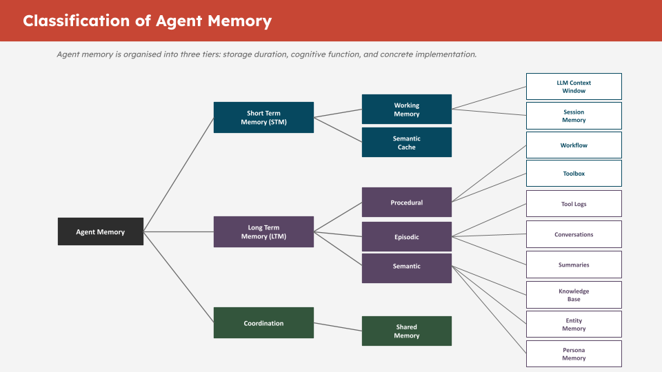

# Part 3: Memory Engineering and Agent Memory

## What Is Agent Memory?

An LLM has no persistent state between calls. Every inference starts from scratch. Agent memory is the infrastructure that gives agents the ability to remember across turns, sessions, and tasks.



The key insight is that different types of information need different storage and retrieval strategies:

| Memory Type | What It Stores | Storage | Retrieval |
|---|---|---|---|
| **Conversational** | Chat history per thread | SQL table | Exact, ordered by time |
| **Knowledge base** | Documents and facts | Vector table | Semantic similarity |
| **Workflow** | Procedural steps and patterns | Vector table | Semantic similarity |
| **Toolbox** | Available tools and descriptions | Vector table | Semantic similarity |
| **Entity** | Named entities and relationships | Vector table | Semantic similarity |
| **Summary** | Compressed context windows | Vector table | Semantic similarity |
| **Tool log** | Raw tool call outputs | SQL table | Exact, by tool call ID |

**Conversational and tool log memory use plain SQL tables** because you always need the exact, ordered history — there is no fuzzy retrieval, you need every message in sequence.

**All semantic memory types use vector-enabled tables** because you need relevance-ranked retrieval — you never retrieve the entire knowledge base, only what is relevant to the current query.

## TODO 6: `create_conversational_history_table`

This function creates the SQL table that stores chat history. Each row is one message turn.

**Why `SYS_GUID()`?** Oracle's built-in UUID generator. It creates a globally unique ID for each row without requiring a sequence or application-side ID generation.

**Why `summary_id`?** When conversation messages are summarised and offloaded in Part 4, this column links each original message to its summary. Without it, the agent cannot track which messages have been compacted or retrieve the original conversation from a summary reference.

**Complete solution:**

```python
def create_conversational_history_table(conn, table_name: str = "CONVERSATIONAL_MEMORY"):
    with conn.cursor() as cur:
        try:
            cur.execute(f"DROP TABLE {table_name}")
        except:
            pass  # Table does not exist yet — that is fine

        cur.execute(f"""
            CREATE TABLE {table_name} (
                id          VARCHAR2(100) DEFAULT SYS_GUID() PRIMARY KEY,
                thread_id   VARCHAR2(100) NOT NULL,
                role        VARCHAR2(50)  NOT NULL,
                content     CLOB NOT NULL,
                timestamp   TIMESTAMP DEFAULT CURRENT_TIMESTAMP,
                metadata    CLOB,
                created_at  TIMESTAMP DEFAULT CURRENT_TIMESTAMP,
                summary_id  VARCHAR2(100) DEFAULT NULL
            )
        """)

        cur.execute(f"""
            CREATE INDEX idx_{table_name.lower()}_thread_id ON {table_name}(thread_id)
        """)

        cur.execute(f"""
            CREATE INDEX idx_{table_name.lower()}_timestamp ON {table_name}(timestamp)
        """)

    conn.commit()
    print(f"Table {table_name} created successfully with indexes")
    return table_name
```

**Why `role VARCHAR2(50)`?** Stores `"user"`, `"assistant"`, or `"tool"`. 50 characters provides headroom for future role types.

**Why `CLOB` for content?** Messages can be long — tool outputs especially. `CLOB` (Character Large Object) stores up to 4GB of text. `VARCHAR2` maxes out at 32KB in Oracle.

**Why indexes?** The `thread_id` index speeds up all per-thread lookups (every read and write is scoped by thread). The `timestamp` index speeds up ordering, which is used on every conversation retrieval.

## TODO 7: Initialise the 5 Vector Memory Stores

Each semantic memory type gets its own `OracleVS` instance backed by its own vector-enabled SQL table. This separation gives you:

- Independent indexes per memory type (faster per-type queries)
- Clean schema boundaries (no mixed-type rows in one table)
- The ability to drop and rebuild one memory type without affecting others

**Complete solution:**

```python
knowledge_base_vs = OracleVS(
    client=vector_conn,
    embedding_function=embedding_model,
    table_name=KNOWLEDGE_BASE_TABLE,
    distance_strategy=DistanceStrategy.COSINE,
)

workflow_vs = OracleVS(
    client=vector_conn,
    embedding_function=embedding_model,
    table_name=WORKFLOW_TABLE,
    distance_strategy=DistanceStrategy.COSINE,
)

toolbox_vs = OracleVS(
    client=vector_conn,
    embedding_function=embedding_model,
    table_name=TOOLBOX_TABLE,
    distance_strategy=DistanceStrategy.COSINE,
)

entity_vs = OracleVS(
    client=vector_conn,
    embedding_function=embedding_model,
    table_name=ENTITY_TABLE,
    distance_strategy=DistanceStrategy.COSINE,
)

summary_vs = OracleVS(
    client=vector_conn,
    embedding_function=embedding_model,
    table_name=SUMMARY_TABLE,
    distance_strategy=DistanceStrategy.COSINE,
)
```

## The MemoryManager Class (Pre-built — Read Carefully)

The `MemoryManager` class is provided in the next code cell after the guard assertions. It is provided complete — you do not need to modify it. But read through it, because understanding how it works is central to the workshop.

Key methods to understand:

**`write_conversation(thread_id, role, content)`** — Inserts a row into `CONVERSATIONAL_MEMORY`. Called programmatically by the agent harness on every turn.

**`read_conversation(thread_id, limit)`** — Retrieves the last N turns for a thread. Returns them in chronological order so the LLM sees a coherent conversation.

**`write_knowledge(text, metadata)`** — Embeds text and inserts into `SEMANTIC_MEMORY`. Used to load domain knowledge the agent can retrieve.

**`read_knowledge(query, k)`** — Semantic search over the knowledge base. Returns the k most relevant documents for a query.

**`write_toolbox(tool_name, description, metadata)`** — Embeds a tool description and stores it in `TOOLBOX_MEMORY`. Enables the agent to retrieve only relevant tools for a given task.

**`read_toolbox(query, k)`** — Semantic search over registered tools. This is how the agent selects which tools to use without being given all tools on every call.

## Programmatic vs Agent-Triggered Operations

This is the most important design decision in memory engineering. Read the "Programmatic vs Agent-Triggered Operations" section carefully.

**Programmatic (always runs, harness controls it):**
- Writing conversation turns after each message
- Reading recent conversation history at the start of each turn
- Writing tool call outputs to the tool log

**Agent-triggered (LLM decides when to call it):**
- Searching the knowledge base
- Retrieving workflow patterns
- Summarising the context window
- Expanding a stored summary

Getting this boundary wrong in either direction causes problems:
- Too much programmatic = LLM context floods with irrelevant tokens every turn
- Too much agent-triggered = important state gets missed because the LLM forgot to retrieve it

## Troubleshooting

**`AttributeError: 'NoneType' has no attribute ...`** — One of your `OracleVS` instances is still `None`. Check that your TODO cell ran successfully and the variables are assigned.

**`ORA-00942: table or view does not exist`** — The conversational memory table was not created. Re-run the `create_conversational_history_table` cell.

**`ORA-01408: such column list already indexed`** — An HNSW index already exists on this table from a prior run. The `safe_create_index` helper handles this. If you see it outside that helper, check the index name for a typo.

---

## MemoryManager TODOs (8–11)

The `MemoryManager` class has four methods left for you to implement. Each one teaches a different pattern — SQL insert, vector add, structured vector add with metadata, and direct entity storage.

---

### TODO 8: `write_conversational_memory` — SQL INSERT

This is the foundational SQL write. Every user and assistant message gets written here programmatically on each turn.

```python
def write_conversational_memory(self, content: str, role: str, thread_id: str) -> str:
    thread_id = str(thread_id)
    with self.conn.cursor() as cur:
        id_var = cur.var(str)
        cur.execute(f"""
            INSERT INTO {self.conversation_table} (thread_id, role, content, metadata, timestamp)
            VALUES (:thread_id, :role, :content, :metadata, CURRENT_TIMESTAMP)
            RETURNING id INTO :id
        """, {"thread_id": thread_id, "role": role, "content": content, "metadata": "{}", "id": id_var})
        record_id = id_var.getvalue()[0] if id_var.getvalue() else None
    self.conn.commit()
    return record_id
```

**Key concept:** `RETURNING id INTO :id` is Oracle's way of capturing an auto-generated value from an INSERT in a single round trip. `cur.var(str)` creates an output bind variable that Oracle writes the new ID into.

---

### TODO 9: `write_knowledge_base` — Vector Add

This is the simplest vector write — pass text and metadata directly to OracleVS which handles embedding and insertion.

```python
def write_knowledge_base(self, text: str, metadata: dict):
    self.knowledge_base_vs.add_texts([text], [metadata])
```

**Key concept:** Both arguments must be lists even when adding a single document. OracleVS batches the embedding calls, so the list interface keeps the API consistent whether you add 1 or 1,000 documents.

---

### TODO 10: `write_workflow` — Structured Vector Add

Workflow memory requires structuring the data before storing it — the steps list needs formatting and the metadata needs computing before the vector write.

```python
def write_workflow(self, query: str, steps: list, final_answer: str, success: bool = True):
    steps_text = "\n".join([f"Step {i+1}: {s}" for i, s in enumerate(steps)])
    text = f"Query: {query}\nSteps:\n{steps_text}\nAnswer: {final_answer[:200]}"
    metadata = {
        "query": query,
        "success": success,
        "num_steps": len(steps),
        "timestamp": datetime.now().isoformat()
    }
    self.workflow_vs.add_texts([text], [metadata])
```

**Key concept:** The `num_steps` metadata field enables filtered retrieval — `read_workflow` uses `filter={"num_steps": {"$gt": 0}}` to exclude empty workflows. Storing computable fields as metadata is the pattern that makes filtered vector search useful.

---

### TODO 11: `write_entity` — Direct Entity Storage

The direct storage branch (no LLM extraction) stores a single named entity as a vector alongside its metadata.

```python
# else branch — direct storage
self.entity_vs.add_texts(
    [f"{name} ({entity_type}): {description}"],
    [{"name": name, "type": entity_type, "description": description}]
)
```

**Key concept:** The text format `"Name (TYPE): description"` is deliberate — embedding the type into the text means semantic searches like "find a database system" will surface entities of type SYSTEM, because the word "system" is part of the embedded string.